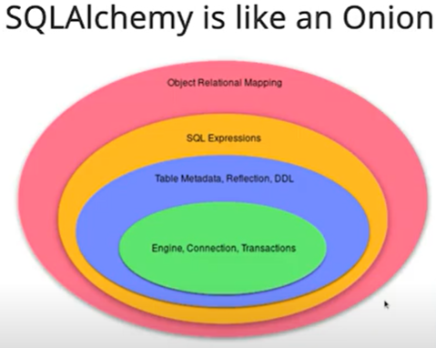

### How to run it

When in the project root create and start env
```commandline
python -m venv env
```
```commandline
env\Scripts\activate
```

Use requirements to install the dependencies
```commandline
pip install -r requirements.txt
```
For cmd line demo start the project using 
```commandline
python run.py
``` 
and follow the instructions provided within the command line (input etc.)

For interacting with the main part of the project - Flask web app, use
```commandline
python main.py
``` 

### Example
Unfortunately as for the moment, one cannot browse in the entire database before searching
for a recommendation. Since the search is an exact match search, it is quite difficult to actually use it.
Here a few examples of books to try out.

- flawless search with a unique book title: "Tell Me This Isn't Happening"
- search of need of disambiguation because multiple books from different authors exist: "Selected poems"
- in order to demonstrate exact match search one might even search "Selected Poems" which yields different book set
- one of the limitations to be fixed is how to deal with the same book from the same author, which has different ISBN
because it is from a different edition: "The Lord of the Rings"

### GOALS of the project
- have a first handson experience with making a flask app
- connect an app with a database
- try working with Dask
- for the sake of curiousity (not functionality) test out `argparse` library
- emphasis on project structure

### TODO

- create pdoc - improve documentation
- ~~make a visualization of the distribution of all ratings~~
- make a visualization of the distribution of mean ratings
- allow multiple arguments for argparse to avoid ambiguity
- resolve duplicated book-titles + authors
  - e.g. one author with the same title which has multiple ISBNs
- ~~build a database~~
  - ~~create table for books~~
  - ~~create table for ratings~~
- ~~turn it into a flask/django web app~~
  - https://medium.com/@joseortizcosta/search-utility-with-flask-and-mysql-60bb8ee83dad
- version history?

### Database issues
Not enough theoretical knowledge
- I build a database which is a collection of tables
- Each table is created as a class where I define its columns
- I have to connect to a database, add and commit potential inserts
- When whatever I was doing is done I should close the connection too
- What is an engine though?
- What is a **build factory**?
- How can I insert big csvs to a database table? (somehow dd.to_sql does not deliver)
 from https://www.youtube.com/watch?v=1Va493SMTcY

### Takeaways from learning about databases
- SQLalchemy builds on top of DBAPI
- the first step is to create an engine -> I can choose which type of "dialect" I will be using
- the dialects are for example sqlite, mysql...(thats what URI is doing)
- engine is lazy, so it doesnt connect to anything unless I tell him to
- what is the difference between a connection and a session?
- database metadata = tables and columns
- what is the difference between model and schema?
- I don't need to track changes or do abstract stuff, so I can use CORE I guess
- trying to figure out what works for SQLalchemy 1.X and 2.0 is insane

### IDEAS
- ISBNs seem to be pretty messed up (at least in ranking)
  - $, ´, Ô½, ooo probably not meant to be in ISBN
  - it would be great to have a tool that validates ISBN as per its [standard](https://en.wikipedia.org/wiki/International_Standard_Book_Number)
- inserting new books would be a great feature too
- additional information for books such as genre would probably help
- it is difficult to enter books without seeing the database -> browsing could be useful
- when the final book is found, I could turn it into a clickable link that would open its cover